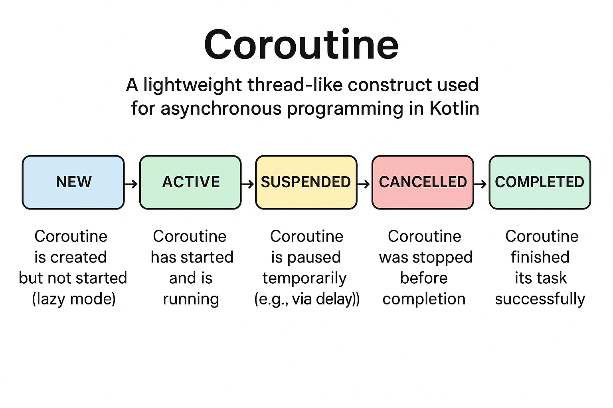
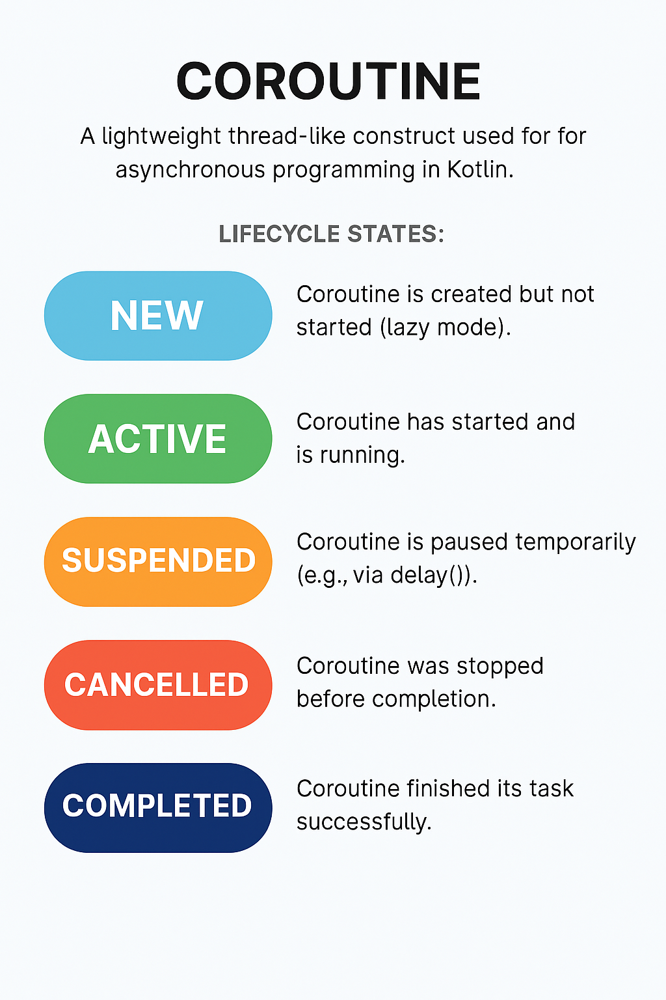
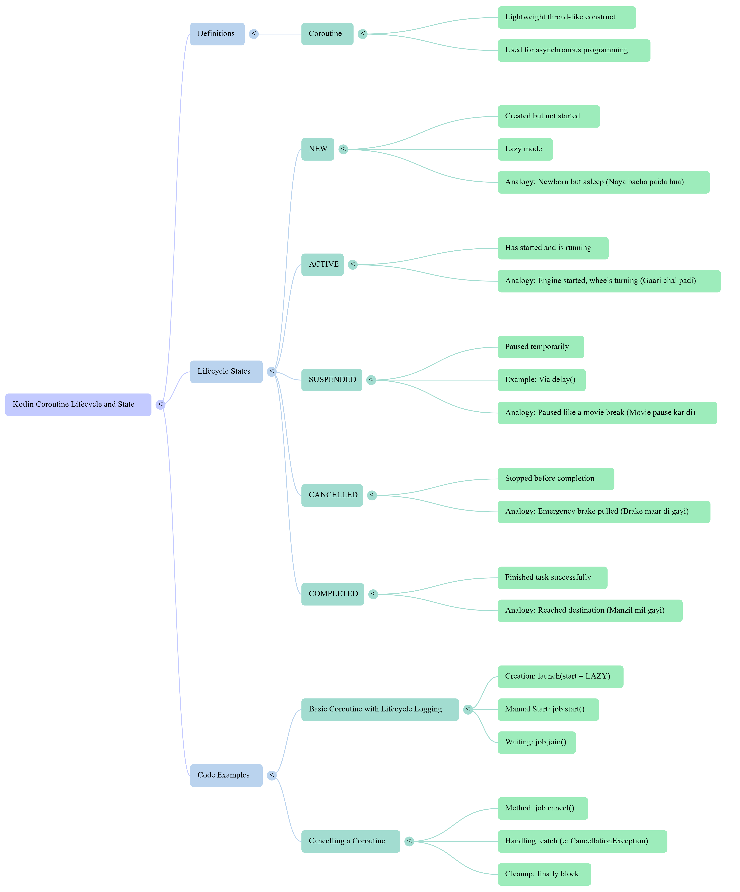

# coroutineverse
**Complete Kotlin Coroutines Guide** covering **every topic** from basics to advanced!  
**Definitions** | **Mnemonics (English+Urdu)** | **Code Examples** | **Real-world use cases**

---

━━━━━━━━━━━━━━━━━━━━━━━━━━━━━━━━━━━
## 🧵 Kotlin Coroutines  

## 🔤 Definitions

- **Coroutine**: A lightweight thread-like construct used for asynchronous programming in Kotlin.
- **Lifecycle States**:
  - `NEW`: Coroutine is created but not started (`lazy` mode).
  - `ACTIVE`: Coroutine has started and is running.
  - `SUSPENDED`: Coroutine is paused temporarily (e.g., via `delay()`).
  - `CANCELLED`: Coroutine was stopped before completion.
  - `COMPLETED`: Coroutine finished its task successfully.

---

## 🧠 Mnemonics & Analogies (English + Urdu)

| State        | Mnemonic (English)                              | Analogy (Urdu)                                                                 |
|--------------|--------------------------------------------------|--------------------------------------------------------------------------------|
| `NEW`        | "Newborn but asleep"                            | **Naya bacha paida hua hai, lekin abhi so raha hai** – coroutine abhi start nahi hui |
| `ACTIVE`     | "Engine started, wheels turning"                | **Gaari chal padi hai** – coroutine ka kaam shuru ho gaya hai 🔥              |
| `SUSPENDED`  | "Paused like a movie break"                     | **Movie pause kar di hai** – `delay()` ne temporary roka hai                  |
| `CANCELLED`  | "Emergency brake pulled"                        | **Brake maar di gayi** – kaam adhura chhod diya gaya                          |
| `COMPLETED`  | "Reached destination"                           | **Manzil mil gayi** – coroutine ne apna kaam mukammal kar liya 🏁              |



---

## 💻 Code Examples

### ✅ Basic Coroutine with Lifecycle Logging

```kotlin
// Importing all coroutine features
import kotlinx.coroutines.*

fun main() = runBlocking {
    // Creating a coroutine lazily (not started yet)
    val job = launch(start = CoroutineStart.LAZY) {
        println("🔥 Coroutine ACTIVE")
        delay(1000) // suspends coroutine for 1 second
        println("🏁 Coroutine COMPLETED")
    }

    println("State: NEW ➤ Coroutine created lazily (not started yet)")

    job.start() // starting the coroutine manually
    println("State: ACTIVE ➤ Coroutine started running")

    delay(500) // simulate mid-execution suspension
    println("State: SUSPENDED ➤ delay() temporarily paused coroutine")

    job.join() // wait until coroutine finishes execution
    println("State: COMPLETED ➤ Coroutine work finished successfully")
}
```

### ❌ Cancelling a Coroutine

```kotlin
// Import all coroutine utilities
import kotlinx.coroutines.*

fun main() = runBlocking {
    // Launch a coroutine in the current scope
    val job = launch {
        try {
            // Repeat 5 times with delay to simulate ongoing work
            repeat(5) { i ->
                println("Working... $i")
                delay(500) // suspends coroutine for 0.5 seconds
            }
        } 
        // This block catches cancellation
        catch (e: CancellationException) {
            println("State: CANCELLED ➤ Coroutine ko cancel kar diya gaya")
        } 
        // Always runs (like finally block in try-catch)
        finally {
            println("🏁 Coroutine COMPLETED ➤ Cleanup done")
        }
    }

    delay(1000) // Let the coroutine run for a while
    job.cancel() // Cancel the coroutine
    job.join() // Wait until coroutine fully terminates
}
```

---

---

━━━━━━━━━━━━━━━━━━━━━━━━━━━━━━━━━━━
## 🧭 `runBlocking` & `launch` in Kotlin  

## 🔤 Definitions (runBlocking & launch)

- **`runBlocking {}`**  
  Blocks the current thread until all coroutines inside it complete. Commonly used in `main()` or tests. Think of it as the **shift manager** who waits until all tasks are done before closing the kitchen.

- **`launch {}`**  
  Starts a new coroutine without blocking the current thread. Think of it as assigning a task to a **kitchen worker** who works independently.

---

## 🧠 Mnemonics & Analogies (English + Urdu)

| Concept        | Mnemonic (English)                                  | Analogy (Urdu)                                                                 |
|----------------|------------------------------------------------------|--------------------------------------------------------------------------------|
| `runBlocking`  | "Main manager waits till all tasks are done"        | **Kitchen ka manager har kaam mukammal hone tak rukta hai**                   |
| `launch`       | "Assign task to worker, let them work independently" | **Kaam kisi worker ko de diya, ab wo apne hisaab se karega**                 |
| `delay()`      | "Simulates time taken for a task"                   | **Kaam mein lagne wala waqt dikhane ke liye delay use hota hai**             |

---

## 💻 Code Examples

### 🍽️ Kitchen Shift Simulation with `runBlocking` and `launch`

```kotlin
// Import coroutine library
import kotlinx.coroutines.*

fun main() {
    println("Program Start: Opening the kitchen for the shift.")

    // runBlocking = Acts like the whole kitchen shift manager.
    // It blocks the main thread until all assigned coroutine tasks inside it are done.
    runBlocking {
        println("  [runBlocking]: Kitchen shift starts. (Thread: ${Thread.currentThread().name})")

        // Task 1: Washing dishes (takes ~1 second)
        launch {
            println("    [Launch 1]: Started washing dishes...")
            delay(1000L) // Simulate a long-running task
            println("    [Launch 1]: ...Dishes are clean.")
        }

        // Task 2: Prepping vegetables (takes ~0.5 seconds)
        launch {
            println("    [Launch 2]: Started prepping vegetables...")
            delay(500L) // Simulate a shorter task
            println("    [Launch 2]: ...Vegetables are prepped.")
        }

        // This part runs right after launching both tasks.
        println("  [runBlocking]: Main coroutine has assigned all tasks and is now waiting...")
        // runBlocking will pause here until both 'launch' coroutines finish.
    }

    // This line runs only after runBlocking (and all its coroutines) complete.
    println("Program End: All kitchen tasks are done. Shift over. Locking the door.")
}
```

---
---

━━━━━━━━━━━━━━━━━━━━━━━━━━━━━━━━━━━
## 🧑‍💼 `launch` with `job.join()` in `runBlocking`  

## 🔤 Definitions (launch)

- **`launch {}`**  
  Starts a coroutine in a fire-and-forget style. It runs independently and doesn’t block the current coroutine.

- **`job.join()`**  
  Suspends the current coroutine until the launched coroutine (`job`) finishes. Think of it as the manager waiting for the worker to complete the task.

- **`runBlocking {}`**  
  Blocks the current thread until all child coroutines inside it finish. Commonly used in `main()` functions.

---

## 🧠 Mnemonics & Analogies (English + Urdu)

| Concept        | Mnemonic (English)                                      | Analogy (Urdu)                                                                 |
|----------------|----------------------------------------------------------|--------------------------------------------------------------------------------|
| `launch`       | "Send a worker to do a task, don’t wait"                | **Kaam kisi worker ko de diya, manager apna kaam karta raha**                |
| `job.join()`   | "Manager waits for the worker to finish"                | **Manager ruk gaya jab tak worker ka kaam mukammal nahi ho gaya**            |
| `runBlocking`  | "Main thread waits for all child tasks"                 | **Main thread tab tak rukta hai jab tak saare kaam mukammal na ho jayein**   |

---

## 💻 Code Examples

### 🧑‍🍳 Manager & Worker Analogy with `launch` and `job.join()`

```kotlin
// Import coroutine utilities
import kotlinx.coroutines.*

fun main() = runBlocking { // 'runBlocking' ensures main waits for all child coroutines to finish
    
    println("Manager (main coroutine): I need to send this report, but I have my own work to do.")
    println("Manager (main coroutine): Thread: ${Thread.currentThread().name}\n")

    // L = Launch a Worker
    // 'launch' = fire-and-forget coroutine
    // It starts a new coroutine but doesn’t block the current one.
    val job = launch { 
        println("  Worker (launch): Got the task! Starting to send the report...")
        println("  Worker (launch): Thread: ${Thread.currentThread().name}")
        delay(1000L) // Simulate a long-running background task
        println("  Worker (launch): ...Report has been sent!")
    }

    // The manager continues immediately without waiting for the worker to finish
    println("Manager (main coroutine): Great, I've 'launched' that worker. Now I'll do my own paperwork.")
    delay(300L) // Simulate a shorter task for the manager
    println("Manager (main coroutine): ...Finished my paperwork.\n")

    // Even if we don’t call job.join(),
    // 'runBlocking' automatically waits for all its children before exiting.
    println("Manager (main coroutine): Now I'll just wait for that worker to be done...")
    job.join() // Explicitly wait for the launched worker to complete
    println("Manager (main coroutine): OK, the worker is done. Time to go home.")
}
```

---
---

━━━━━━━━━━━━━━━━━━━━━━━━━━━━━━━━━━━
## ⚡ `async` & `await` in Kotlin  

## 🔤 Definitions (async & await)

- **`async {}`**  
  Starts a coroutine that returns a result via a `Deferred<T>`. Multiple `async` blocks can run concurrently.

- **`await()`**  
  Suspends the current coroutine until the result of the `Deferred` is ready. It’s non-blocking and efficient.

- **Concurrency vs Parallelism**  
  `async` enables **concurrent** execution — tasks start together and run independently, saving time.

---

## 🧠 Mnemonics & Analogies (English + Urdu)

| Concept        | Mnemonic (English)                                      | Analogy (Urdu)                                                                 |
|----------------|----------------------------------------------------------|--------------------------------------------------------------------------------|
| `async`        | "Send multiple requests at once"                        | **Ek saath do kaam ke liye farmaish bhej di gayi**                            |
| `await()`      | "Wait for each answer when it’s ready"                  | **Har jawab ka intezar jab wo tayar ho jaye**                                 |
| `Deferred`     | "Promise of a future result"                            | **Wada kiya gaya hai ke result baad mein milega**                             |
| `measureTimeMillis` | "Track total time taken for tasks"                | **Pura waqt naapne ke liye stopwatch lagaya gaya hai**                        |

---

## 💻 Code Examples

### 👤 Building a User Profile Concurrently with `async` & `await`

```kotlin
// Import coroutine features and utility for measuring execution time
import kotlinx.coroutines.*
import kotlin.system.measureTimeMillis

// Simulates a slow network call to fetch a user's name
suspend fun fetchUsername(): String {
    println("  [Async 1]: Asking for username... (will take 1000ms)")
    delay(1000L) // Simulate network delay
    return "KotlinHero" // Return fetched username
}

// Simulates a slow network call to fetch a profile picture
suspend fun fetchProfilePictureUrl(): String {
    println("  [Async 2]: Asking for profile picture... (will take 1500ms)")
    delay(1500L) // Simulate network delay
    return "https://example.com/pic.png" // Return fetched picture URL
}

fun main() = runBlocking {
    println("Main: Need to build the user profile. I will ask for data.\n")

    val totalTime = measureTimeMillis {
        // 'async' = start concurrent tasks that return results
        // Both requests start *at the same time* (not one after another)
        val deferredUsername: Deferred<String> = async { fetchUsername() }
        val deferredPictureUrl: Deferred<String> = async { fetchProfilePictureUrl() }

        println("Main: I have 'asked' for both username and picture. Now I wait for the answers.")
        println("Main: ...waiting...\n")

        // 'await()' suspends until the result is ready (non-blocking)
        val username = deferredUsername.await()
        println("Main: Got the username! It is '$username'")

        val pictureUrl = deferredPictureUrl.await()
        println("Main: Got the picture URL! It is '$pictureUrl'\n")

        // Use both results together
        println("Main: ✅ Success! Displaying profile for '$username' with image at '$pictureUrl'")
    }

    // Measure total time — should be close to the longest single delay (≈1500ms)
    println("\nMain: Total time taken: $totalTime ms")
}
```

---
---

━━━━━━━━━━━━━━━━━━━━━━━━━━━━━━━━━━━
## ⏳ `delay()` vs `Thread.sleep()` in Coroutines  

## 🔤 Definitions ( delay() vs Thread.sleep() )

- **`delay(timeMillis)`**  
  Suspends the coroutine without blocking the thread. Other coroutines can run during this time. Ideal for non-blocking asynchronous tasks.

- **`Thread.sleep(timeMillis)`**  
  Blocks the entire thread. No other coroutine on that thread can run until sleep ends. Not recommended inside coroutines.

- **Concurrency Impact**  
  `delay()` enables concurrent execution, while `Thread.sleep()` forces sequential blocking.

---

## 🧠 Mnemonics & Analogies (English + Urdu)

| Concept           | Mnemonic (English)                                      | Analogy (Urdu)                                                                 |
|-------------------|----------------------------------------------------------|--------------------------------------------------------------------------------|
| `delay()`         | "Pause the coroutine, but let others work"              | **Chef ne paani ubalne diya, aur saath saath sabzi kaat li**                 |
| `Thread.sleep()`  | "Freeze the thread, no one else can work"               | **Chef sirf pateeli ko ghoorta raha, sabzi kaatna bhi ruk gaya**             |
| `runBlocking`     | "Kitchen manager waits till all tasks finish"           | **Manager tab tak rukta hai jab tak sab kaam mukammal na ho jayein**         |

---

## 💻 Code Examples

### 🍳 Comparing Non-Blocking vs Blocking in the Kitchen

```kotlin
// Import coroutine utilities and time measurement function
import kotlinx.coroutines.*
import kotlin.system.measureTimeMillis

fun main() {
    println("--- Example 1: Using delay() (Non-Blocking) ---")
    println("Analogy: The Chef puts water on to boil, then chops veggies while waiting.\n")

    // Measure how long the non-blocking example takes
    val nonBlockingTime = measureTimeMillis {
        runBlocking {
            // Coroutine 1: Boil water
            launch {
                println("  [Boil Water]: Starting... (will 'delay' for 1000ms)")
                // D = Don't Block Delay
                // 'delay()' suspends this coroutine but frees the thread 
                // so other coroutines can run meanwhile.
                delay(1000L)
                println("  [Boil Water]: ...Water is boiling!")
            }

            // Coroutine 2: Chop vegetables
            launch {
                println("    [Chop Veggies]: Starting to chop veggies...")
                delay(250L) // First chopping phase
                println("    [Chop Veggies]: ...still chopping...")
                delay(250L) // Second chopping phase
                println("    [Chop Veggies]: ...Veggies are done.")
            }
        }
    }
    println("Total time for Example 1: $nonBlockingTime ms (✅ Both tasks ran concurrently)\n")


    println("--- Example 2: Using Thread.sleep() (Blocking) ---")
    println("Analogy: The Chef *stares* at the pot, blocking all other work.\n")

    // Measure how long the blocking example takes
    val blockingTime = measureTimeMillis {
        runBlocking {
            // Coroutine 1: Boil water (but using Thread.sleep)
            launch {
                println("  [Stare at Pot]: Starting... (will 'Thread.sleep' for 1000ms)")
                // This BLOCKS the entire thread.
                // While sleeping, no other coroutine on this thread can execute.
                Thread.sleep(1000L)
                println("  [Stare at Pot]: ...Water is boiling!")
            }

            // Coroutine 2: Chop vegetables
            launch {
                println("    [Chop Veggies]: Starting to chop veggies...")
                delay(250L)
                println("    [Chop Veggies]: ...still chopping...")
                delay(250L)
                println("    [Chop Veggies]: ...Veggies are done.")
            }
        }
    }
    println("Total time for Example 2: $blockingTime ms (❌ Tasks ran one after the other)")
}
```

---
---

━━━━━━━━━━━━━━━━━━━━━━━━━━━━━━━━━━━
## 🤝 `join()` in Kotlin Coroutines  

## 🔤 Definitions ( join() )

- **`join()`**  
  Suspends the current coroutine until the specified coroutine (`Job`) completes. It’s used when you want to wait for a concurrent task to finish before proceeding.

- **`launch {}`**  
  Starts a coroutine that runs concurrently. It returns a `Job` which can be joined or cancelled.

- **Use Case**  
  Perfect for scenarios where one coroutine depends on another’s completion before continuing.

---

## 🧠 Mnemonics & Analogies (English + Urdu)

| Concept     | Mnemonic (English)                                  | Analogy (Urdu)                                                                 |
|-------------|------------------------------------------------------|--------------------------------------------------------------------------------|
| `launch`    | "Send a friend to do a task"                        | **Dost ko kaam de diya, wo apne hisaab se karega**                            |
| `join()`    | "Wait for your friend to finish before starting together" | **Dost ka kaam mukammal hone ka intezar, phir mil kar kaam shuru karna**     |
| `delay()`   | "Simulate time taken for a task"                    | **Kaam mein lagne wala waqt dikhane ke liye delay use hota hai**             |

---

## 💻 Code Examples

### 🎲 Game Night Analogy with `launch` and `join()`

```kotlin
// Import coroutine utilities
import kotlinx.coroutines.*

fun main() = runBlocking {
    println("You (Main): Let's get ready for game night!")

    // Start your friend's task in a separate coroutine
    // 'launch' starts a new coroutine that runs concurrently
    val friendJob = launch {
        println("  Friend (Job): Starting to set up the complex board game...")
        delay(1500L) // Simulate a long setup task
        println("  Friend (Job): ...Game is set up!")
    }

    // Meanwhile, you do your own shorter task
    println("You (Main): I'll go get the snacks. (My task takes 500ms)")
    delay(500L) // Simulate your snack-fetching time
    println("You (Main): ...Snacks are ready. Is my friend done?")
    println("You (Main): ---> Now I will 'join()' my friend and wait for them. <---\n")
    
    // J = Join when Done
    // 'join()' suspends the main coroutine until 'friendJob' completes
    friendJob.join() 

    // This runs only after the friend's coroutine finishes
    println("\nYou (Main): Great, my friend is done! Now we can start the game together.")
}
```

---
---

━━━━━━━━━━━━━━━━━━━━━━━━━━━━━━━━━━━

## 🛑 Coroutine Cancellation with `cancel()`  

## 🔤 Definitions ( cancel() )

- **`cancel()`**  
  Sends a cancellation signal to a coroutine. If the coroutine is suspended (e.g., at `delay()`), it throws a `CancellationException`.

- **`try-catch-finally` in coroutines**  
  Used to handle cancellation gracefully. `catch` handles the cancellation exception, and `finally` ensures cleanup (e.g., closing files, releasing resources).

- **Suspension Point**  
  A place like `delay()` where the coroutine checks for cancellation and can be interrupted.

---

## 🧠 Mnemonics & Analogies (English + Urdu)

| Concept           | Mnemonic (English)                                      | Analogy (Urdu)                                                                 |
|-------------------|----------------------------------------------------------|--------------------------------------------------------------------------------|
| `cancel()`        | "Cut off the task midway"                               | **Manager ne kaam beech mein rok diya**                                       |
| `delay()`         | "Pause point where cancellation is checked"             | **Kaam rukne ki jagah jahan worker check karta hai ke kaam cancel hua ya nahi** |
| `finally` block   | "Always clean up after stopping"                        | **Kaam chhodne ke baad desk saaf karna zaroori hai**                          |

---

## 💻 Code Examples

### 📄 Report Compilation with Cancellation Logic

```kotlin
// Import coroutine utilities
import kotlinx.coroutines.*

fun main() = runBlocking {
    println("Manager (Main): I need this 100-section report compiled. Start working.")

    // Start the worker coroutine that will do the long task
    val workerJob = launch {
        try {
            // The worker will compile 100 sections
            repeat(100) { i ->
                println("  Worker (Job): Compiling report, section ${i + 1}...")
                
                // 'delay()' is a suspension point.
                // The coroutine checks for cancellation here — 
                // if cancelled, it throws a CancellationException.
                delay(500L)
            }
        } catch (e: CancellationException) {
            println("  Worker (Job): Ah! The manager told me to stop. ${e.message}")
        } finally {
            // This block always runs (even after cancellation)
            // Used for cleanup work like closing files or releasing resources.
            println("  Worker (Job): Stopping work and cleaning up my desk.")
        }
    }

    // Let the worker run for 1.3 seconds before interrupting
    println("\nManager (Main): (Letting worker run for 1.3 seconds...)\n")
    delay(1300L)

    // C = Cut Off Coroutine
    // Cancel the worker — sends a cancellation signal
    println("Manager (Main): That's enough. STOP THE TASK!")
    workerJob.cancel() // Cancel signal sent

    // Wait for the worker to finish its 'finally' block
    workerJob.join()

    println("Manager (Main): Good, the worker has stopped.")
}
```

---
---

━━━━━━━━━━━━━━━━━━━━━━━━━━━━━━━━━━━

## 📊 Coroutine State Checks: `isActive`, `isCompleted`, `isCancelled`  

## 🔤 Definitions (isActive , isCompleted, isCancelled)

- **`isActive`**  
  Returns `true` if the coroutine is currently running and hasn’t completed or been cancelled.

- **`isCompleted`**  
  Returns `true` if the coroutine has finished successfully or with an exception.

- **`isCancelled`**  
  Returns `true` if the coroutine was cancelled before completion.

- **`yield()`**  
  Gives other coroutines a chance to run. Useful for cooperative multitasking.

---

## 🧠 Mnemonics & Analogies (English + Urdu)

| Property         | Mnemonic (English)                                      | Analogy (Urdu)                                                                 |
|------------------|----------------------------------------------------------|--------------------------------------------------------------------------------|
| `isActive`       | "Is the worker still busy?"                             | **Kya worker abhi bhi kaam mein masroof hai?**                                |
| `isCompleted`    | "Has the worker finished the task?"                     | **Kya worker ne kaam mukammal kar liya hai?**                                 |
| `isCancelled`    | "Was the task stopped midway?"                          | **Kya kaam beech mein rok diya gaya tha?**                                    |
| `yield()`        | "Let others take a turn"                                | **Thodi der ke liye doosre ko kaam karne do**                                |

---

## 💻 Code Examples

### 🧪 Monitoring Coroutine Lifecycle States

```kotlin
import kotlinx.coroutines.*  // Import coroutine library

fun main() = runBlocking {
    println("Manager: I'm launching a worker for a 2-second task.")

    // Launch a coroutine as a Job
    val workerJob = launch {
        println("  Worker (Job): Starting my task...")
        delay(2000L) // Simulate a 2-second task
        println("  Worker (Job): ...Task complete.")
    }

    yield() // Let coroutine start before checking status

    // ✅ Check 1 — right after start: should be active
    println("Manager (at 0ms): Is the worker active? ${workerJob.isActive}")

    println("Manager: I'll do other work for 1 second...")
    delay(1000L) // Simulate manager’s work

    // ✅ Check 2 — after 1 second: still active
    println("Manager (at 1000ms): Still active? ${workerJob.isActive}")

    // Wait for the coroutine to complete
    println("Manager: Waiting for the worker to finish...")
    if (workerJob.isActive) println("Job is still active before join()")

    workerJob.join() // Suspend until worker finishes

    // ✅ Check 3 — after join(): check job states
    when {
        workerJob.isActive -> println("Job is unexpectedly still active.")
        workerJob.isCompleted -> println("Job has completed successfully.")
        workerJob.isCancelled -> println("Job was cancelled.")
        else -> println("Job state unknown.")
    }

    // Final confirmation
    println("Manager (at 2000ms): Final IsActive = ${workerJob.isActive}")
}
```

---
---

━━━━━━━━━━━━━━━━━━━━━━━━━━━━━━━━━━━

## 🧭 Coroutine Dispatchers in Kotlin  

## 🔤 Definitions (Coroutine Dispatchers)

- **`Dispatchers.IO`**  
  Optimized for I/O-bound tasks like reading files, accessing databases, or making network calls.

- **`Dispatchers.Default`**  
  Designed for CPU-intensive tasks like sorting, calculations, or data processing.

- **`Dispatchers.Unconfined`**  
  Starts in the current thread but may resume on a different thread after suspension. Useful for lightweight tasks or debugging.

- **`runBlocking`**  
  Blocks the current thread until all child coroutines complete. Often used in `main()` functions.

---

## 🧠 Mnemonics & Analogies (English + Urdu)

| Dispatcher         | Mnemonic (English)                                      | Analogy (Urdu)                                                                 |
|--------------------|----------------------------------------------------------|--------------------------------------------------------------------------------|
| `Dispatchers.IO`   | "Warehouse for slow I/O tasks"                          | **Warehouse jahan file read/write aur network ka kaam hota hai**              |
| `Dispatchers.Default` | "Office for fast brain work"                        | **Office jahan calculations aur data processing hoti hai**                    |
| `Dispatchers.Unconfined` | "Freelancer who works anywhere"                 | **Freelancer jo pehle ek jagah kaam shuru karta hai, phir kahin aur chala jata hai** |
| `runBlocking`      | "Main desk that waits for all workers"                 | **Main desk jahan manager sab kaam mukammal hone ka intezar karta hai**       |

---

## 💻 Code Examples

### 🧵 Dispatching Tasks to Different Workstations

```kotlin
import kotlinx.coroutines.*  // Import coroutine support

fun main() = runBlocking {
    // 🏢 This 'runBlocking' coroutine is our "Main Desk"
    // It runs on the main thread and waits for all child coroutines to complete.
    println("Main Desk ('runBlocking'): Running on thread ➤ ${Thread.currentThread().name}\n")

    // ───────────────────────────────
    // 1️⃣ Dispatchers.IO  → "Warehouse" for I/O heavy tasks (e.g., reading files, network calls)
    // ───────────────────────────────
    launch(Dispatchers.IO) {
        println("  [IO Workstation]: Task started ➤ Thread: ${Thread.currentThread().name}")
        delay(500L) // Simulate I/O operation (suspends coroutine)
        println("  [IO Workstation]: ...Task finished ✅")
    }

    // ───────────────────────────────
    // 2️⃣ Dispatchers.Default  → "Office" for CPU-heavy tasks (e.g., computations)
    // ───────────────────────────────
    launch(Dispatchers.Default) {
        println("  [Default Office]: Task started ➤ Thread: ${Thread.currentThread().name}")
        var count = 0
        repeat(100_000) { count += 1 } // Simulate CPU work
        println("  [Default Office]: ...Task finished ✅ (Counted to $count)")
    }

    // ───────────────────────────────
    // 3️⃣ Dispatchers.Unconfined  → "Freelancer"
    // Starts in the current thread but may resume on a different one after suspension.
    // ───────────────────────────────
    launch(Dispatchers.Unconfined) {
        println("  [Unconfined Task]: Started ➤ Thread: ${Thread.currentThread().name}")
        delay(100L) // Suspension point (context may change)
        println("  [Unconfined Task]: Resumed ➤ Thread: ${Thread.currentThread().name}")
    }

    // ───────────────────────────────
    // The main desk will wait for all launched tasks to finish before ending.
    // ───────────────────────────────
    println("\nMain Desk ('runBlocking'): All tasks dispatched. Waiting for them to complete...")
}
```

---
---

━━━━━━━━━━━━━━━━━━━━━━━━━━━━━━━━━━━

## 🧮 CPU-Intensive Work with `Dispatchers.Default`  

## 🔤 Definitions

- **`Dispatchers.Default`**  
  Optimized for CPU-bound tasks like sorting, calculations, and data transformations. Uses a shared pool of background threads.

- **`launch(Dispatchers.Default)`**  
  Starts a coroutine on a thread suitable for CPU-heavy operations.

- **`measureTimeMillis {}`**  
  Measures how long a block of code takes to execute in milliseconds.

---

## 🧠 Mnemonics & Analogies (English + Urdu)

| Concept               | Mnemonic (English)                                      | Analogy (Urdu)                                                                 |
|------------------------|----------------------------------------------------------|--------------------------------------------------------------------------------|
| `Dispatchers.Default` | "Send to the CPU desk for brain-heavy work"             | **CPU Desk jahan calculations aur sorting jaise kaam hote hain**              |
| `launch`              | "Assign a worker to do the task"                        | **Worker ko kaam de diya, wo apne thread par kaam karega**                    |
| `measureTimeMillis`   | "Track how long the whole task took"                    | **Stopwatch lagaya gaya taake total waqt naap sakein**                        |

---

## 💻 Code Examples

### 🧠 Sorting a Massive List with `Dispatchers.Default`

```kotlin
import kotlinx.coroutines.*        // Coroutine library
import kotlin.random.Random        // For generating random numbers
import kotlin.system.measureTimeMillis // To measure total execution time

// ⚙️ Heavy CPU-intensive task (Sorting a massive list)
suspend fun sortHugeList(): List<Int> {
    // Show which thread this coroutine is running on
    println("  [CPU Desk]: Task started ➤ Thread: ${Thread.currentThread().name}")
    println("  [CPU Desk]: Sorting 50,000,000 numbers...")

    // Generate a large list of random integers
    val bigList = List(50_000_000) { Random.nextInt() }

    // 'sorted()' is CPU-bound, so it's ideal for Dispatchers.Default
    val sortedList = bigList.sorted()

    println("  [CPU Desk]: ...Sorting complete ✅")
    return sortedList
}

fun main() = runBlocking {
    // 🏢 Main coroutine (acts like the manager)
    println("Manager (main): Running on thread ➤ ${Thread.currentThread().name}")
    println("Manager (main): I need this giant list sorted, but I can’t do it myself.")
    println("Manager (main): Dispatching the task to the Default CPU Desk.\n")

    var resultList: List<Int> = emptyList()

    // ⏱ Measure total time taken for sorting + other manager tasks
    val timeTaken = measureTimeMillis {
        
        // ⚡ Launching a coroutine on Dispatchers.Default (optimized for CPU work)
        val job = launch(Dispatchers.Default) {
            resultList = sortHugeList()
        }

        // 🧑‍💼 Meanwhile, the Manager continues doing other short tasks
        println("Manager (main): The CPU Desk is working. I'm free to multitask...")
        delay(500L)
        println("Manager (main): ...just checked my email.")
        delay(500L)
        println("Manager (main): ...had some coffee ☕")

        // 🕓 Wait for the CPU worker to finish
        println("Manager (main): Now, I’ll wait for that job to be done.")
        job.join()
    }

    // ✅ After completion
    println("\nManager (main): The CPU Desk finished the job!")
    println("Manager (main): The first number in the sorted list is ${resultList.first()}.")
    println("Manager (main): Total time taken: $timeTaken ms")
}
```

---
---

━━━━━━━━━━━━━━━━━━━━━━━━━━━━━━━━━━━

## 🔄 Switching Context with `withContext(Dispatchers.IO)`  

## 🔤 Definitions ( withContext(Dispatchers.IO) )

- **`withContext(dispatcher) {}`**  
  Suspends the current coroutine and switches its execution to a different dispatcher (thread pool). Commonly used for I/O or CPU-bound tasks.

- **`Dispatchers.IO`**  
  Optimized for I/O-bound operations like network requests, file reading, or database access.

- **Context Switching**  
  Allows coroutines to run on the most suitable thread for the task, improving performance and responsiveness.

---

## 🧠 Mnemonics & Analogies (English + Urdu)

| Concept             | Mnemonic (English)                                      | Analogy (Urdu)                                                                 |
|----------------------|----------------------------------------------------------|--------------------------------------------------------------------------------|
| `withContext(IO)`    | "Send the worker to the server room"                   | **Worker ko server room bhej diya gaya hai taake data le aaye**               |
| `Dispatchers.IO`     | "Best place for slow I/O tasks"                        | **Aisi jagah jahan file read/write aur network ka kaam hota hai**             |
| `runBlocking`        | "Main office that waits for all workers"              | **Manager ka office jahan sab kaam mukammal hone ka intezar hota hai**        |

---

## 💻 Code Examples

### 🌐 Network Request with `withContext(Dispatchers.IO)`

```kotlin
import kotlinx.coroutines.*

/**
 * 🛰️ Simulates a network call to fetch data from a server.
 * Ideal for Dispatchers.IO — because it’s I/O-bound (waiting on external data).
 */
suspend fun fetchDataFromServer(url: String): String {
    println("  [Manager]: Need data from '$url'.")
    println("  [Manager]: Dispatching a worker to the 'Server Room' (Dispatchers.IO).")

    // 🔄 Switch context from the current thread (main) to the IO dispatcher
    return withContext(Dispatchers.IO) {
        println("    [IO Worker]: Arrived at 'Server Room'. (Thread: ${Thread.currentThread().name})")
        println("    [IO Worker]: Making network request to '$url'...")

        // 🕒 Simulate a delay (representing network wait time)
        delay(1500L)

        println("    [IO Worker]: ...Got response! Returning data to Manager.")
        "{'data': 'This is the server response'}" // Return result back to caller
    }
}

fun main() = runBlocking {
    // 🏢 The "Manager's Office" — our main thread
    println("Manager (main): I'm in my office. (Thread: ${Thread.currentThread().name})")

    // 🚀 Launch a coroutine for the background task
    val job = launch {
        val serverData = fetchDataFromServer("https://api.example.com/data")

        // 💡 Once withContext() completes, control returns to the main thread
        println("Manager (main): Back in the office. (Thread: ${Thread.currentThread().name})")
        println("Manager (main): Worker returned: $serverData")
    }

    // 🧾 Meanwhile, the manager does other tasks while the IO worker waits for response
    println("Manager (main): Worker is off to the server. I'll do my own paperwork.")
    delay(500L)
    println("Manager (main): ...filing reports...")
    delay(500L)
    println("Manager (main): ...paperwork done. Worker should be back soon.")

    // 🕓 Wait for launched job to finish before closing runBlocking
    job.join()
}
```

---
---

━━━━━━━━━━━━━━━━━━━━━━━━━━━━━━━━━━━

## 🌀 `Dispatchers.Unconfined` in Kotlin  

## 🔤 Definitions (Dispatchers.Unconfined)

- **`Dispatchers.Unconfined`**  
  A coroutine dispatcher that starts execution in the current thread but may resume on a different thread after suspension. It’s not confined to any specific thread or thread pool.

- **Use Case**  
  Best suited for lightweight tasks or debugging. Not recommended for UI or production-critical code due to unpredictable thread behavior.

- **Suspension Behavior**  
  After a suspension point (e.g., `delay()`), the coroutine may resume on a different thread.

---

## 🧠 Mnemonics & Analogies (English + Urdu)

| Concept               | Mnemonic (English)                                      | Analogy (Urdu)                                                                 |
|------------------------|----------------------------------------------------------|--------------------------------------------------------------------------------|
| `Unconfined`           | "Freelancer who works anywhere, anytime"               | **Freelancer jo kaam shuru ek jagah karta hai, lekin resume kahin aur karta hai** |
| `delay()`              | "Pause point that frees the thread"                    | **Kaam mein thoda rukawat jahan thread free ho jata hai**                     |
| `runBlocking`          | "Manager’s desk that waits for all workers"           | **Manager ka desk jahan sab kaam mukammal hone ka intezar hota hai**          |

---

## 💻 Code Examples

### 🧑‍💻 Freelance Worker Analogy with `Dispatchers.Unconfined`

```kotlin
import kotlinx.coroutines.*

fun main() = runBlocking {
    // 🏢 The Manager is the main coroutine running on the main thread
    println("Manager (runBlocking): I'm on my thread: ${Thread.currentThread().name}")
    println("Manager (runBlocking): I'm hiring an 'Unconfined' freelancer...")

    // 🌀 U = Unconfined (Free)
    // This coroutine is not restricted to any specific thread.
    // It can start on one thread and resume on another.
    launch(Dispatchers.Unconfined) {
        // 1️⃣ THE START
        println("  Freelancer (Unconfined): STARTING work. Using thread: ${Thread.currentThread().name}")

        // 2️⃣ THE SUSPENSION
        println("  Freelancer (Unconfined): ...doing research (delaying 500ms)...")
        delay(500L) // Suspension point — coroutine pauses, freeing thread

        // 3️⃣ THE RESUMPTION
        // After delay, resumes on a different thread (not guaranteed same one)
        println("  Freelancer (Unconfined): RESUMING work on possibly another thread: ${Thread.currentThread().name}")

        println("  Freelancer (Unconfined): ...Work done.")
    }

    // The Manager continues working on the main thread
    println("Manager (runBlocking): Freelancer started instantly (no dispatch delay).")
    println("Manager (runBlocking): I'll do my own work for 1 second...")
    delay(1000L)
    println("Manager (runBlocking): My work is done. Program can now end.")
}
```

---
---

━━━━━━━━━━━━━━━━━━━━━━━━━━━━━━━━━━━

## 🌐 `GlobalScope` vs Local Scope (`runBlocking`)  

## 🔤 Definitions ( GlobalScope vs Local Scope (`runBlocking`) )

- **`GlobalScope.launch {}`**  
  Launches a coroutine that lives independently of the current scope. It’s not tied to the lifecycle of the caller (e.g., `runBlocking`, `Activity`, etc.).

- **`launch {}` inside `runBlocking`**  
  Launches a coroutine that is a child of the current scope. It automatically completes when the parent (`runBlocking`) finishes.

- **`join()`**  
  Suspends the current coroutine until the target coroutine finishes. Required for `GlobalScope` jobs if you want to wait for them manually.

---

## 🧠 Mnemonics & Analogies (English + Urdu)

| Concept             | Mnemonic (English)                                      | Analogy (Urdu)                                                                 |
|----------------------|----------------------------------------------------------|--------------------------------------------------------------------------------|
| `GlobalScope`        | "Company-wide task that runs independently"            | **Company ka backup jo manager ke scope se bahar hai**                        |
| `runBlocking`        | "Manager’s desk supervising team tasks"                | **Manager ka desk jahan sirf apni team ka kaam monitor hota hai**            |
| `join()`             | "Wait manually for independent task to finish"         | **Manager ko backup ka intezar khud se karna padta hai**                     |

---

## 💻 Code Examples

### 🧑‍💼 Team Task vs Global Backup with `GlobalScope`

```kotlin
import kotlinx.coroutines.*

// Opt-in for using GlobalScope safely
@OptIn(DelicateCoroutinesApi::class)
fun main() = runBlocking {
    // runBlocking = Acts like the "Manager" supervising all team tasks in one scope
    println("Manager (runBlocking): My shift has started.\n")

    // 1️⃣ Launch a normal coroutine (child of runBlocking)
    launch {
        println("  [Team Task]: Starting our short task... (500ms)")
        delay(500L) // Simulate a short team task
        println("  [Team Task]: ...Team task is done.\n")
    }

    // 2️⃣ Launch a coroutine in GlobalScope (not a child of runBlocking)
    val globalJob = GlobalScope.launch {
        println("    [GlobalScope]: Starting 'All-Night Backup'... (takes 1000ms)")
        delay(1000L) // Simulate a longer, company-wide operation
        println("    [GlobalScope]: ...'All-Night Backup' is complete.\n")
    }

    // Manager continues after starting both coroutines
    println("Manager (runBlocking): I've started my 'Team Task' and the 'Global Backup'.")
    println("Manager (runBlocking): I only have to wait for my own team...\n")

    // ✅ runBlocking automatically waits for its own child coroutines (like 'launch')
    // ❌ But it does NOT wait for GlobalScope coroutines — those live independently

    println("Manager (runBlocking): ...Ok, my team is done. Now I'll manually wait for the 'Global Backup' to finish.")
    globalJob.join() // Manually wait for GlobalScope job to finish

    // Everything done
    println("\nManager (runBlocking): Everything is finished. My shift is over.")
}
```

---
---

━━━━━━━━━━━━━━━━━━━━━━━━━━━━━━━━━━━

## 🍽️ Custom `CoroutineScope(Job())` & Structured Cancellation  

## 🔤 Definitions ( CoroutineScope(Job()) )

- **`CoroutineScope(Job())`**  
  Creates an independent coroutine scope with its own lifecycle. Coroutines launched in this scope are children of the custom `Job()`.

- **`launch {}` inside custom scope**  
  Starts child coroutines tied to the custom scope. Cancelling the scope cancels all its children.

- **`cancel()`**  
  Cancels the entire scope and all its child coroutines. Useful for structured shutdowns.

---

## 🧠 Mnemonics & Analogies (English + Urdu)

| Concept                 | Mnemonic (English)                                      | Analogy (Urdu)                                                                 |
|--------------------------|----------------------------------------------------------|--------------------------------------------------------------------------------|
| `CoroutineScope(Job())` | "Create a new kitchen with its own head chef"           | **Nayi kitchen jahan Head Chef apne cooks ko manage karta hai**              |
| `launch`                | "Assign a cook to a dish"                               | **Har cook ko alag dish banane ka kaam diya gaya hai**                        |
| `cancel()`              | "Close the kitchen and stop all cooks"                  | **Kitchen band kar do, sab cooks ka kaam rok do**                             |

---

## 💻 Code Examples

### 👨‍🍳 Kitchen Analogy with Custom `CoroutineScope` and Cancellation

```kotlin
import kotlinx.coroutines.*

fun main() = runBlocking { // The "Restaurant" is the main CoroutineScope
    println("Restaurant Owner (Main): Open the kitchen! (Creating CoroutineScope)\n")

    // 👨‍🍳 Create a new independent CoroutineScope (Head Chef)
    // 'Job()' gives this scope full control over its child coroutines (the cooks)
    val kitchenScope = CoroutineScope(Job())

    // 🥣 Cook 1 (Child Job 1)
    kitchenScope.launch {
        println("  [Cook 1]: Starting to make a complex 5-second soup...")
        try {
            delay(5000L) // Simulate long soup-making task
            println("  [Cook 1]: ...Soup is ready!") // This line won't run if cancelled
        } catch (e: CancellationException) {
            println("  [Cook 1]: STOP! The Head Chef is closing the kitchen! (Job cancelled)")
        }
    }

    // 🍞 Cook 2 (Child Job 2)
    kitchenScope.launch {
        println("  [Cook 2]: Starting to bake a 5-second bread...")
        try {
            delay(5000L) // Simulate long bread-baking task
            println("  [Cook 2]: ...Bread is baked!") // This line won't run if cancelled
        } catch (e: CancellationException) {
            println("  [Cook 2]: STOP! Dropping everything! (Job cancelled)")
        }
    }

    // 🕒 Let the kitchen run for 1 second before shutdown
    println("Restaurant Owner (Main): (Kitchen is running...)\n")
    delay(1000L)

    // 🚪 Time to close
    println("\nRestaurant Owner (Main): We're closed! SHUT DOWN THE KITCHEN!")

    // ❌ Cancels all child jobs (cooks) under kitchenScope
    kitchenScope.cancel()

    // ⏳ Small delay to let cancellation messages print
    delay(500L)

    println("\nRestaurant Owner (Main): The kitchen is dark. All cooks have gone home.")
}
```

---
---

━━━━━━━━━━━━━━━━━━━━━━━━━━━━━━━━━━━

## 🔄 Context Switching with `withContext(IO)` & `withContext(Default)`  

## 🔤 Definitions ( withContext() )

- **`withContext(Dispatchers.IO)`**  
  Switches coroutine execution to a thread optimized for I/O-bound tasks like network calls or file access.

- **`withContext(Dispatchers.Default)`**  
  Switches coroutine execution to a thread optimized for CPU-bound tasks like data processing or computation.

- **Context Switching**  
  Allows coroutines to run on the most suitable thread pool for their workload, improving performance and responsiveness.

---

## 🧠 Mnemonics & Analogies (English + Urdu)

| Concept                   | Mnemonic (English)                                      | Analogy (Urdu)                                                                 |
|----------------------------|----------------------------------------------------------|--------------------------------------------------------------------------------|
| `withContext(IO)`          | "Send task to the Network Department"                  | **Kaam ko Network Department mein bhej diya gaya (file ya server se data lena)** |
| `withContext(Default)`     | "Send task to the Analytics Department"                | **Kaam ko Analytics Department mein bhej diya gaya (data process karna)**     |
| `runBlocking`              | "Manager’s Office that coordinates everything"         | **Manager ka office jahan se saare departments ko kaam diya jata hai**        |

---

## 💻 Code Examples

### 🧠 Manager Delegates Tasks to Network & Analytics Departments

```kotlin
import kotlinx.coroutines.*

// 🌐 This function represents the "Network Department"
// It performs IO-bound work such as fetching data from a server.
suspend fun fetchReportFromNetwork(): String {
    println("  [Manager]: Handing off task to Network Department...")

    // ⚙️ WC = Work Context Switch
    // Switch to Dispatchers.IO (for network or disk operations)
    val report = withContext(Dispatchers.IO) {
        println("    [Network Dept]: Starting fetch on thread: ${Thread.currentThread().name}")
        delay(1000L) // Simulate a network delay
        println("    [Network Dept]: ...Data fetched.")
        "Confidential Report Data" // Value returned from this block
    }

    // 🔙 After withContext, we automatically return to the caller's thread
    println("  [Manager]: ...Got the report back!")
    return report
}

// 📊 This function represents the "Analytics Department"
// It performs CPU-heavy computations (data analysis, etc.)
suspend fun analyzeReport(data: String): String {
    println("  [Manager]: Handing off report to Analytics Department...")

    // ⚙️ WC = Work Context Switch
    // Switch to Dispatchers.Default (for CPU-intensive processing)
    val analysis = withContext(Dispatchers.Default) {
        println("    [Analytics Dept]: Starting analysis on thread: ${Thread.currentThread().name}")
        // Simulate a CPU-heavy operation
        val processedData = data.uppercase().reversed()
        delay(1000L) // Simulate computation time
        println("    [Analytics Dept]: ...Analysis complete.")
        "'$processedData'" // Return the processed (analyzed) result
    }

    println("  [Manager]: ...Got the analysis back!")
    return analysis
}

fun main() = runBlocking { // 🧠 The "Manager's Office"
    println("[Manager]: Starting work in my office on thread: ${Thread.currentThread().name}")

    // --- 📨 Task 1: Fetching Report from Network ---
    val reportData = fetchReportFromNetwork()
    println("[Manager]: Back in office, checking my thread: ${Thread.currentThread().name}")
    println("[Manager]: Received data: '$reportData'\n")

    // --- 📈 Task 2: Analyzing the Report ---
    val finalAnalysis = analyzeReport(reportData)
    println("[Manager]: Back in office again, thread is: ${Thread.currentThread().name}")
    println("[Manager]: Final result: $finalAnalysis")

    println("\n[Manager]: ✅ All tasks done. My thread never got blocked!")
}
```

---
---

━━━━━━━━━━━━━━━━━━━━━━━━━━━━━━━━━━━

## 🧩 `Job` vs `SupervisorJob` — Handling Failure in Coroutine Teams  

## 🔤 Definitions (Job vs SupervisorJob)

- **`Job`**  
  A regular coroutine job. If one child coroutine fails, it cancels all its siblings and the parent.

- **`SupervisorJob`**  
  A special job that isolates failures. If one child fails, it doesn’t cancel the others.

- **`CoroutineExceptionHandler`**  
  A handler that catches uncaught exceptions in coroutines and logs or handles them gracefully.

---

## 🧠 Mnemonics & Analogies (English + Urdu)

| Concept           | Mnemonic (English)                                      | Analogy (Urdu)                                                                 |
|--------------------|----------------------------------------------------------|--------------------------------------------------------------------------------|
| `Job`              | "Panicked team lead — shuts down everyone on failure"  | **Ghabraya hua lead — ek worker fail hua to sab ko nikaal diya**              |
| `SupervisorJob`    | "Calm team lead — handles failure without panic"       | **Samajhdar lead — ek worker fail hua to baqi team ko kaam karne diya**       |
| `CoroutineExceptionHandler` | "Catch and log the crash"                     | **Crash hone par exception ko pakar kar report karna**                         |

---

## 💻 Code Examples

### 🧪 Comparing `Job` vs `SupervisorJob` with Team Lead Behavior

```kotlin
import kotlinx.coroutines.*

fun main() = runBlocking {

    // ============================================================
    // 🧩 EXAMPLE 1 — Regular Job (The “Panicked” Team Lead)
    // ============================================================

    println("--- Example 1: Regular Job (The 'Panicked' Team Lead) ---")
    println("If one worker fails, the lead cancels the *entire* team.\n")

    // 🧠 Exception handler for the regular Job
    val normalExceptionHandler = CoroutineExceptionHandler { _, exception ->
        println("  [Panicked Lead]: A worker failed! SHUT DOWN THE WHOLE TEAM! (Caught $exception)")
    }

    // 👷‍♂️ Create a scope using a *regular* Job
    val normalScope = CoroutineScope(Job() + normalExceptionHandler)

    // 👨‍🔧 Worker A — This one will FAIL
    normalScope.launch {
        println("    [Worker A]: Starting. I will fail in 500ms.")
        delay(500L)
        throw RuntimeException("Worker A: I dropped the data!") // Triggers cancellation
    }

    // 👩‍🔧 Worker B — This one is fine but will get cancelled
    normalScope.launch {
        println("    [Worker B]: Starting my long 2-second task.")
        try {
            delay(2000L)
            println("    [Worker B]: ...Finished my task.") // ❌ Won’t be reached
        } catch (e: CancellationException) {
            println("    [Worker B]: ...I was cancelled by the panicked lead! Why?!")
        }
    }

    delay(3000L)
    println("\n--- Example 1 Finished ---\n")


    // ============================================================
    // 🧩 EXAMPLE 2 — SupervisorJob (The “SJ” Good Team Lead)
    // ============================================================

    println("--- Example 2: SupervisorJob (The 'SJ' Good Team Lead) ---")
    println("If one worker fails, the lead handles it calmly, and the rest of the team continues.\n")

    // 🧠 Exception handler for SupervisorJob
    val supervisorExceptionHandler = CoroutineExceptionHandler { _, exception ->
        println("  [Supervisor Lead]: A worker failed. I will log it and let the team continue. (Caught $exception)")
    }

    // 👷‍♀️ Create a scope using a *SupervisorJob*
    val supervisorScope = CoroutineScope(SupervisorJob() + supervisorExceptionHandler)

    // 👨‍🔧 Worker C — This one will FAIL
    supervisorScope.launch {
        println("    [Worker C]: Starting. I will fail in 500ms.")
        delay(500L)
        throw RuntimeException("Worker C: I dropped the data!") // Triggers exception but not mass cancellation
    }

    // 👩‍🔧 Worker D — This one continues successfully
    supervisorScope.launch {
        println("    [Worker D]: Starting my long 2-second task.")
        try {
            delay(2000L)
            println("    [Worker D]: ...Finished my task successfully!") // ✅ Will be reached
        } catch (e: CancellationException) {
            println("    [Worker D]: ...I was cancelled! (This shouldn't happen)")
        }
    }

    delay(3000L)
    println("\n--- Example 2 Finished ---")
}
```

---
---

━━━━━━━━━━━━━━━━━━━━━━━━━━━━━━━━━━━

## 🧭 Coroutine Dispatchers + `GlobalScope`  

## 🔤 Definitions ( Coroutine Dispatchers + GlobalScope )

- **`Dispatchers.Default`**  
  Optimized for CPU-bound tasks like data analysis, sorting, and computation.

- **`Dispatchers.IO`**  
  Designed for I/O-bound tasks like file reading, network calls, and database access.

- **`Dispatchers.Unconfined`**  
  Starts in the current thread and may resume on a different thread after suspension. Lightweight and flexible.

- **`GlobalScope.launch {}`**  
  Launches a coroutine that lives independently of the current scope. It’s not tied to `runBlocking` or any structured parent.

- **`join()`**  
  Suspends the current coroutine until the target coroutine completes. Required for waiting on `GlobalScope` tasks.

---

## 🧠 Mnemonics & Analogies (English + Urdu)

| Concept               | Mnemonic (English)                                      | Analogy (Urdu)                                                                 |
|------------------------|----------------------------------------------------------|--------------------------------------------------------------------------------|
| `Dispatchers.Default` | "Send to CPU desk for brain-heavy work"                | **CPU Desk jahan calculations aur analysis hoti hai**                         |
| `Dispatchers.IO`      | "Send to server room for I/O tasks"                    | **Server Room jahan file download aur network ka kaam hota hai**              |
| `Dispatchers.Unconfined` | "Freelancer who floats between threads"            | **Freelancer jo kaam shuru ek jagah karta hai, phir kahin aur chala jata hai** |
| `GlobalScope`         | "Company-wide task not managed by the office"          | **Company ka kaam jo manager ke scope se bahar hai**                          |
| `join()`              | "Wait manually for independent task to finish"         | **Manager ko global kaam ka intezar khud se karna padta hai**                 |

---

## 💻 Code Examples

### 🧑‍💼 Dispatching Tasks + Handling `GlobalScope`

```kotlin
import kotlinx.coroutines.*

// 🌍 GS = Global Scope
// A "Company-wide" task launched outside any specific manager (runBlocking).
// It starts as soon as the program runs and continues independently.
@OptIn(DelicateCoroutinesApi::class)
val globalTask = GlobalScope.launch {
    println("[GlobalScope]: (Company-wide task started... e.g., checking for updates) Thread: ${Thread.currentThread().name}")
    delay(2500L) // Simulate a long-running background job
    println("[GlobalScope]: (...Company-wide task finished)")
}

fun main() = runBlocking { // 🏢 The "Manager's Office" (Main Thread)
    println("Manager: Starting my day. I'm on thread: ${Thread.currentThread().name}\n")

    // 🧭 D = Dispatcher
    // The Manager assigns tasks to different "workstations" based on the nature of the job.

    // 🧮 Def = Default Dispatcher (CPU-Intensive)
    // For heavy CPU-bound work (like data analysis or computation)
    launch(Dispatchers.Default) {
        println("  [Default-CPU Desk]: Started. (Analyzing big report...) Thread: ${Thread.currentThread().name}")
        delay(1000L) // Simulate CPU-heavy processing
        println("  [Default-CPU Desk]: ...Report analyzed.")
    }

    // 💾 IO = Input/Output Dispatcher (I/O-Intensive)
    // For reading/writing files, network calls, or database operations
    launch(Dispatchers.IO) {
        println("  [IO-Server Room]: Started. (Downloading file...) Thread: ${Thread.currentThread().name}")
        delay(1500L) // Simulate I/O delay
        println("  [IO-Server Room]: ...File downloaded.")
    }

    // 🕊️ U = Unconfined Dispatcher (Thread-Free / Floating Task)
    // Starts immediately in the current thread but can resume on another thread after suspension
    launch(Dispatchers.Unconfined) {
        println("  [Unconfined-Freelancer]: START. (I'm in the Manager's office!) Thread: ${Thread.currentThread().name}")
        delay(100L) // Suspends for a moment...
        println("  [Unconfined-Freelancer]: RESUME. (Now I'm... somewhere else!) Thread: ${Thread.currentThread().name}")
    }

    // 🧍 Manager (main coroutine) continues working while others run
    println("Manager: I've dispatched my three workers. I'll wait 2 seconds for them.")
    delay(2000L) // Wait for Default, IO, and Unconfined tasks
    println("\nManager: My in-house team is done.")

    // ⚙️ Note:
    // runBlocking waits for its *child coroutines* only.
    // The globalTask is NOT a child — it runs independently.
    println("Manager: Now, I must 'join' and wait for the 'GlobalScope' task to finish before I can go home.")
    globalTask.join() // Wait for the company-wide (global) task to finish

    println("Manager: The 'GlobalScope' task is done. All work finished. Closing the office.")
}
```

---
---
